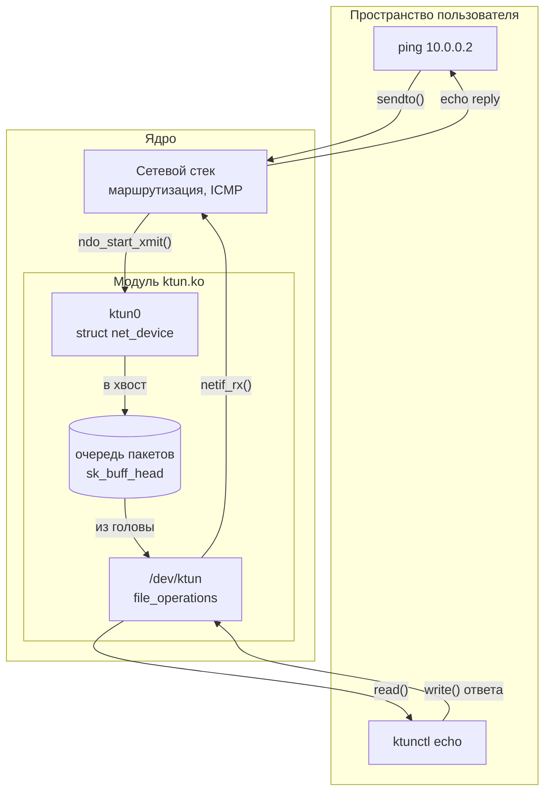
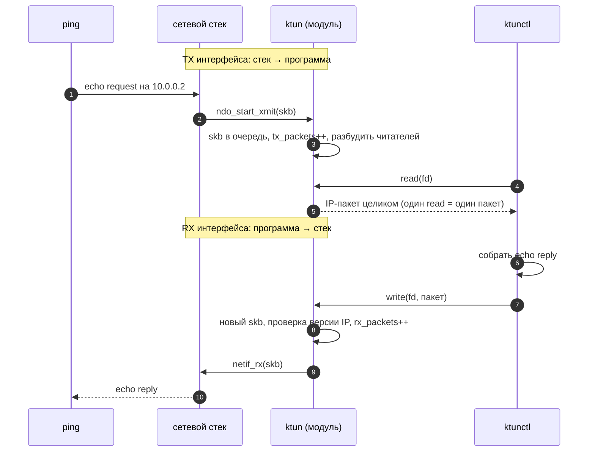
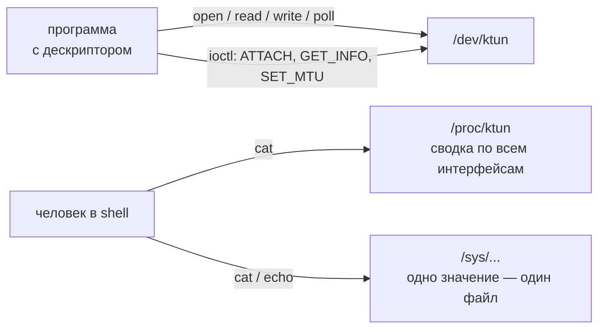
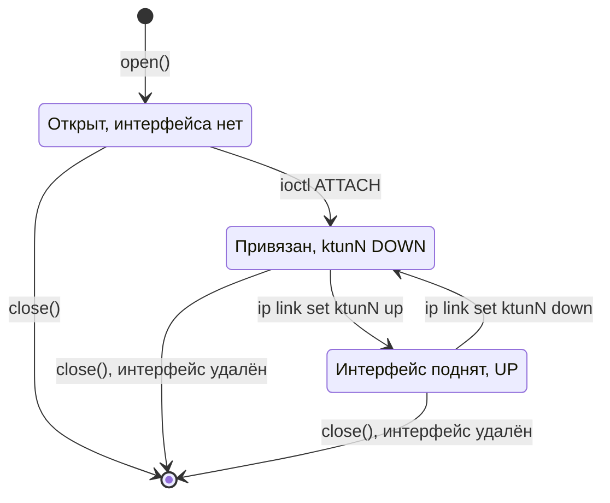
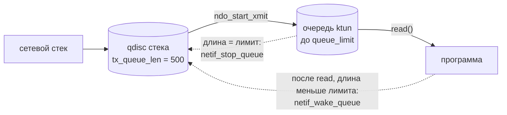

# KernelTunDriver

> Модуль ядра Linux `ktun` — виртуальный сетевой интерфейс TUN-типа, упрощённый аналог
> `drivers/net/tun.c`. Итоговый проект курса OTUS «Разработка ядра Linux».

Модуль создаёт в системе **сетевой интерфейс без сетевой карты**. Он выглядит как `eth0`: у него есть
имя, адрес, MTU и счётчики в `ip link`. Но пакеты, которые система отправляет в этот интерфейс, не
уходят в провод. Их получает **обычная программа**, читая файл `/dev/ktun`. И наоборот: всё, что
программа записала в `/dev/ktun`, система воспринимает как пакет, пришедший из сети.

Так устроены VPN-клиенты, эмуляторы сетей и туннели: программа сама решает, что сделать с пакетом —
зашифровать, отправить по UDP или ответить на него.

| | |
|---|---|
| **Ядро** | Linux 6.18 (LTS), запуск в QEMU |
| **Модуль** | `ktun.ko` → `/dev/ktun`, интерфейсы `ktun0`, `ktun1`, … |
| **Утилита** | `ktunctl` — печать пакетов и ответ на `ping` из userspace |
| **Проверка** | отладочное ядро: KASAN, lockdep, kmemleak, `DEBUG_ATOMIC_SLEEP` |

## Как это работает
### Общая картина



Модуль соединяет две сущности ядра:

- **сетевой интерфейс** (`struct net_device`) — с ним разговаривает сетевой стек;
- **символьное устройство** `/dev/ktun` (`struct file_operations`) — с ним разговаривает программа.

Между ними — очередь пакетов. Она нужна потому, что стек отправляет пакет в атомарном контексте, где
нельзя ни спать, ни копировать данные в память программы, а программа в этот момент может вообще не
сидеть в `read()`. Очередь разводит эти два события во времени.

### Путь пакета


### Почему TX и RX «перевёрнуты»
Счётчики считаются **с точки зрения интерфейса**, как у настоящей сетевой карты. Это первое, что
путает при отладке:

| Направление | Для интерфейса `ktun0` | Для программы | Функции драйвера |
|-------------|------------------------|---------------|------------------|
| стек → программа | **TX** — передано | **читает** из `/dev/ktun` | `ndo_start_xmit` → очередь → `read` |
| программа → стек | **RX** — принято | **пишет** в `/dev/ktun` | `write` → `netif_rx` |

### TUN, а не TAP
Через `/dev/ktun` ходят **голые IP-пакеты**, без Ethernet-заголовка: первый байт прочитанного пакета —
начало IP-заголовка. У интерфейса нет MAC-адреса, и ARP не нужен:

| Поле `net_device` | Значение |
|-------------------|----------|
| `type` | `ARPHRD_NONE` |
| `flags` | `IFF_POINTOPOINT \| IFF_NOARP` |
| `hard_header_len`, `addr_len` | `0` |
| `mtu` / `min_mtu` / `max_mtu` | `1500` / `68` / `9000` |
| `tx_queue_len` | `500` — очередь стека (qdisc) для управления потоком |

## Интерфейсы модуля
Модуль разговаривает с внешним миром по четырём каналам, у каждого своя ниша.



### `/dev/ktun` — данные
| Вызов | Поведение |
|-------|-----------|
| `open` | создаёт **пустое** состояние файла; интерфейса ещё нет |
| `ioctl(KTUN_IOC_ATTACH)` | создаёт `ktunN` и навсегда привязывает его к этому открытому файлу |
| `read` | один вызов = один пакет; ждёт, если очередь пуста (`EAGAIN` при `O_NONBLOCK`) |
| `write` | один вызов = один IPv4/IPv6-пакет; интерфейс должен быть поднят |
| `poll` | `EPOLLIN`, когда в очереди есть пакет; запись готова всегда |
| последний `close` | удаляет интерфейс и всё, что было в очереди |

**Жизненный цикл открытого файла:**


**Каждая программа — своя очередь.** Состояние хранится в открытом файле (`file->private_data`),
поэтому два процесса, открывших `/dev/ktun`, получают два независимых интерфейса и две очереди. Так
выполняется требование курса «у каждого процесса свой буфер». Процессы после `fork()` делят один
открытый файл, а значит, и одну очередь — как и в настоящем `tun`.

### `ioctl` — управление
ABI в [src/ktun_ioctl.h](src/ktun_ioctl.h) общий для модуля и утилиты, поля фиксированной ширины.

| Команда | Что делает | Основные ошибки |
|---------|------------|-----------------|
| `KTUN_IOC_ATTACH` | создать интерфейс; пустое имя → `ktun%d` | `EPERM` без `CAP_NET_ADMIN`, `EBUSY` уже привязан, `EEXIST` имя занято, `EINVAL` плохое имя |
| `KTUN_IOC_GET_INFO` | имя, `ifindex`, MTU, длина и лимит очереди | `EBADFD` не привязан |
| `KTUN_IOC_SET_MTU` | сменить MTU (`dev_set_mtu` под `rtnl_lock`) | `EBADFD`, `EINVAL` вне `[68, 9000]` |
| любая другая | — | `ENOTTY` |

### `/proc/ktun` — сводка
```console
# cat /proc/ktun
name     pid    state  queue   rx_packets  rx_bytes  tx_packets  tx_bytes  tx_dropped  truncated
ktun0    123    up     0/64    3           252       3           252       0           0
ktun1    131    down   2/64    0           0         2           168       0           0
```

### `/sys` — настройки
| Файл | Доступ | Смысл |
|------|--------|-------|
| `/sys/class/misc/ktun/default_queue_limit` | rw | лимит очереди для новых интерфейсов, `[1, 4096]`, по умолчанию `64` |
| `/sys/class/misc/ktun/interface_count` | ro | сколько интерфейсов существует |
| `/sys/class/net/ktunN/ktun/queue_limit` | rw | лимит очереди этого интерфейса |
| `/sys/class/net/ktunN/ktun/queue_len` | ro | сколько пакетов ждут чтения |
| `/sys/class/net/ktunN/ktun/owner_pid` | ro | PID процесса, создавшего интерфейс |

## Устройство изнутри
### Управление потоком
Если программа перестала читать, а стек продолжает отправлять, очередь росла бы без предела. Поэтому
у неё есть лимит, и на лимите драйвер просит стек подождать:



После `netif_stop_queue` драйвер **сразу перепроверяет** длину очереди. Иначе возможна гонка:
`read()` опустошил очередь и проверил «остановлена ли?» за мгновение до остановки, и очередь
осталась бы остановленной навсегда.

### Контексты и блокировки
`ndo_start_xmit` выполняется в атомарном контексте (softirq): там нельзя спать, брать мьютекс,
выделять память с `GFP_KERNEL` и вызывать `copy_to_user`. Отсюда выбор защиты для каждого объекта:

| Данные | Кто обращается | Защита |
|--------|----------------|--------|
| очередь пакетов | `ndo_start_xmit` (BH), `read` | встроенный спинлок `sk_buff_head` |
| счётчики `dev->stats` | `ndo_start_xmit`, `write` | атомарные `DEV_STATS_INC` / `DEV_STATS_ADD` |
| лимит очереди | `ndo_start_xmit`, `/sys` | `READ_ONCE` / `WRITE_ONCE` |
| привязка файла к интерфейсу | `ioctl` из нескольких потоков | мьютекс в состоянии файла |
| глобальный список интерфейсов | `ATTACH`, `close`, `/proc` | глобальный мьютекс |

### Владение `sk_buff`
У каждого пакета в каждый момент ровно один владелец, и освобождает его только владелец:

- стек вызвал `ndo_start_xmit(skb)` → пакет **наш**: положить в очередь или освободить;
- `read()` забрал пакет из очереди → скопировал программе → освободил;
- `write()` создал пакет и вызвал `netif_rx(skb)` → пакет **стека**, трогать его больше нельзя.

Нарушение в одну сторону ловит kmemleak (утечка), в другую — KASAN (use-after-free).

### Порядок удаления интерфейса
При последнем `close()` каждый шаг опирается на гарантию предыдущего:


Выгрузить модуль, пока открыт хоть один `/dev/ktun`, нельзя: `.owner = THIS_MODULE` держит ссылку на
модуль, и `rmmod` вернёт ошибку.

### Структура исходников
```text
.
├── Makefile              # сборка модуля (qemu-*) и утилиты (tools)
├── src/
│   ├── Kbuild            # ktun.o = main.o chardev.o netdev.o procfs.o sysfs.o
│   ├── ktun.h            # внутренние структуры: ktunNet (интерфейс), ktunFile (открытый файл)
│   ├── ktun_ioctl.h      # ABI ioctl, общий с утилитой
│   ├── main.c            # init/exit, misc-устройство, глобальный список интерфейсов
│   ├── chardev.c         # file_operations /dev/ktun
│   ├── netdev.c          # net_device_ops, очередь пакетов, управление потоком
│   ├── procfs.c          # /proc/ktun
│   └── sysfs.c           # атрибуты /sys
├── tools/ktunctl.c       # утилита: dump / echo / selftest
└── devtools/             # стенд QEMU + demo.sh
```

## Сборка и запуск
Модуль собирается и грузится **не в ядро хоста, а в отдельное ядро в QEMU**. Так проект одинаково
работает на обычном Linux и под WSL2, где заголовков ядра хоста нет.

**Зависимости хоста:** `gcc`, `make`, `qemu-system-x86_64`, инструменты сборки ядра (`flex`, `bison`,
`bc`, `libelf-dev`, `libssl-dev`), статическая `libc` для утилиты.

```sh
make qemu-setup-debug   # один раз: ядро 6.18 с KASAN/lockdep/kmemleak + BusyBox initramfs
make qemu-build         # модуль  -> build/ktun.ko
make tools              # утилита -> build/ktunctl (статическая: в госте нет libc)
make qemu-test          # автотест: insmod -> dmesg -> rmmod, печатает TEST_OK
make qemu-boot          # интерактивный гость; каталог проекта смонтирован в /mnt/host
```

KASAN примерно удваивает расход памяти гостя, поэтому стоит задать `QEMU_MEM="2G"` в
`devtools/config.local`.

Отладка через GDB: `make qemu-debug` в одном терминале, `make gdb-attach` в другом.

## Демонстрация
### Ответ на `ping` из userspace
В госте (`make qemu-boot`):

```console
# insmod /mnt/host/build/ktun.ko
# /mnt/host/build/ktunctl echo &
ktun0
# ip link set ktun0 up
# ip addr add 10.0.0.1/24 dev ktun0
# ping -c 3 10.0.0.2
PING 10.0.0.2 (10.0.0.2): 56 data bytes
64 bytes from 10.0.0.2: seq=0 ttl=64 time=0.412 ms
...
3 packets transmitted, 3 packets received, 0% packet loss
```

Машины с адресом `10.0.0.2` не существует. На `ping` отвечает `ktunctl`: она прочитала echo request,
поменяла местами адреса, сменила тип ICMP на echo reply, пересчитала контрольные суммы и записала
пакет обратно.

### Режимы `ktunctl`
```text
ktunctl [-n NAME] [-m MTU] dump      # печатать каждый пакет
ktunctl [-n NAME] [-m MTU] echo      # печатать и отвечать на IPv4 ICMP echo request
ktunctl selftest                     # проверить коды ошибок, которые не получить из shell
```

```console
# ktunctl dump
ktun0
ktun0: IPv6 len=56 (skipped)
ktun0: IPv4 ICMP 10.0.0.1 -> 10.0.0.2 echo request id=12 seq=1 len=84
```

Утилита не настраивает адрес и не поднимает интерфейс — это делают стандартные команды `ip`. Так
видна граница между драйвером и обычной настройкой сети. IPv6-пакеты сразу после `up` — служебные
сообщения самого стека, утилита их только печатает.

## Проверка
Все сценарии выполняются в одном сеансе QEMU на отладочном ядре.

| # | Сценарий | Что показывает |
|---|----------|----------------|
| T1 | загрузка и выгрузка | `/dev/ktun` с правами `0600`, `/proc` и `/sys` на месте, `dmesg` чистый |
| T2 | чтение непривязанного файла | `EBADFD` |
| T3 | привязка | `ktun0` с флагами `POINTOPOINT,NOARP`, верный `owner_pid` |
| T4 | стек → программа | `dump` видит ICMP echo request, растёт TX |
| T5 | ответ на `ping` | 0% потерь, RX = 3 |
| T6 | закрытие файла | интерфейс исчезает |
| T7 | две программы | две независимые очереди и счётчики |
| T8 | управление потоком | при остановленном читателе очередь не растёт выше лимита, нет `asks to queue packet` |
| T9 | настройки `/sys` | неверные значения отклоняются, `default_queue_limit` применяется к новым интерфейсам |
| T10 | MTU | `-m 1400` виден в `ip link`, `-m 10` — ошибка |
| T11 | `ktunctl selftest` | все коды ошибок `ioctl`/`read`/`write` |
| T12 | выгрузка и утечки | `rmmod` запрещён при открытом файле; kmemleak и `dmesg` пусты |

**Критерий чистоты:** в `dmesg` нет `BUG:`, `WARNING:`, `possible circular locking`,
`sleeping function called from invalid context`; kmemleak ничего не находит.

**Стиль кода.** Имена в проекте — в личном стиле автора (PascalCase для функций, camelCase для
переменных, `_` перед полями структур), поэтому `checkpatch` запускается без проверки CamelCase:

```sh
devtools/.cache/linux-*/scripts/checkpatch.pl --no-tree --ignore CAMELCASE -f src/*.c src/*.h tools/*.c
```

## Ограничения
Это сознательные решения, а не недоделки:

| Не поддерживается | Почему |
|-------------------|--------|
| режим TAP (L2, Ethernet-кадры) | вдвое больше работы с заголовками и ARP; TUN полностью раскрывает тему |
| `ip link add type ktun` | требует `rtnl_link_ops` и netlink — отдельная подсистема |
| интерфейсы, переживающие закрытие файла | усложняет жизненный цикл |
| несколько очередей, привязка к CPU, NAPI | вопросы производительности, а не корректности |
| offload'ы (GSO, аппаратные контрольные суммы) | железа нет |
| сетевые пространства имён | интерфейсы создаются в основном пространстве |
| ответ на IPv6 в `ktunctl` | IPv6-пакеты только печатаются |
