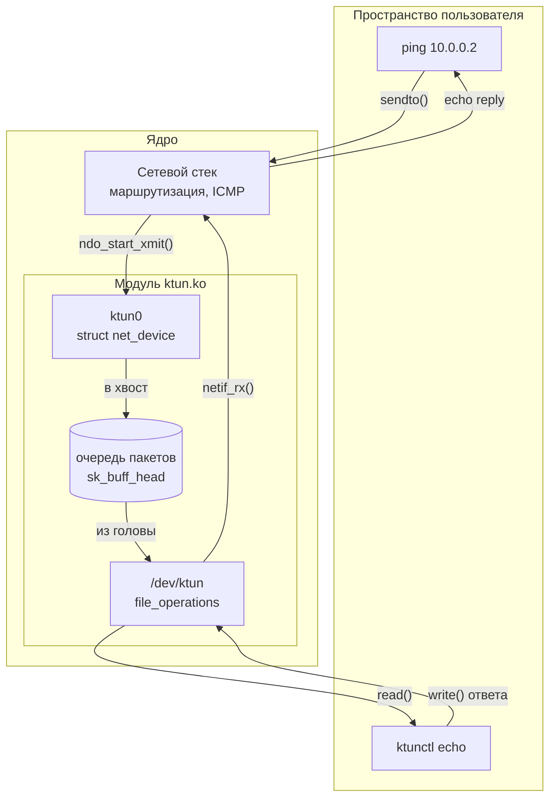
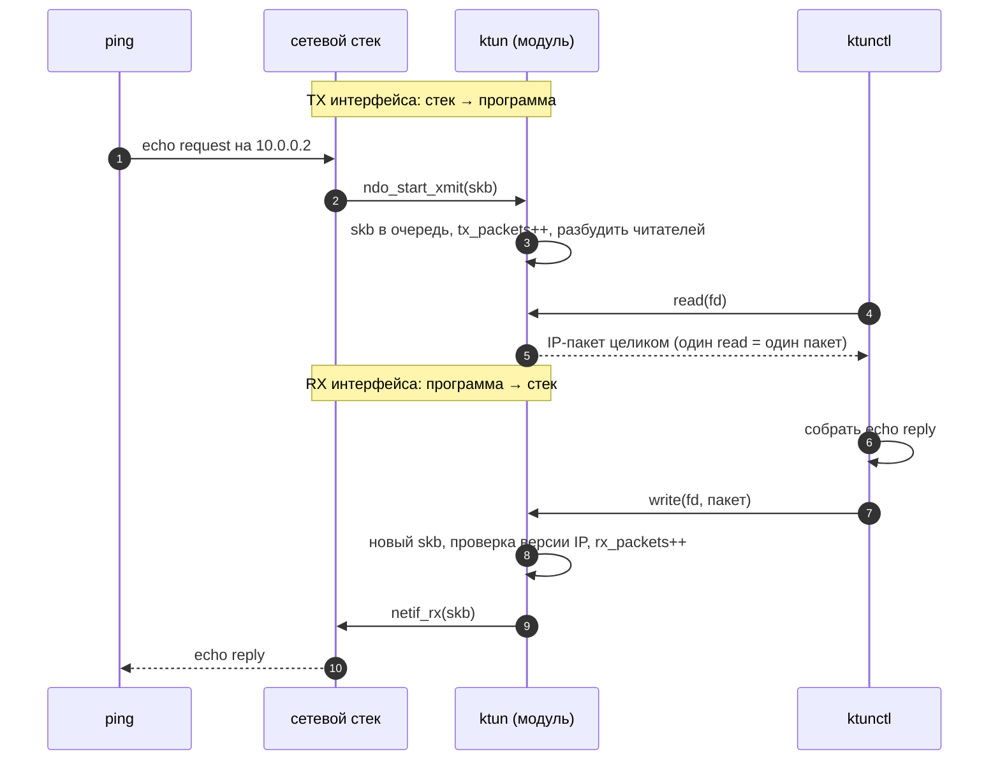
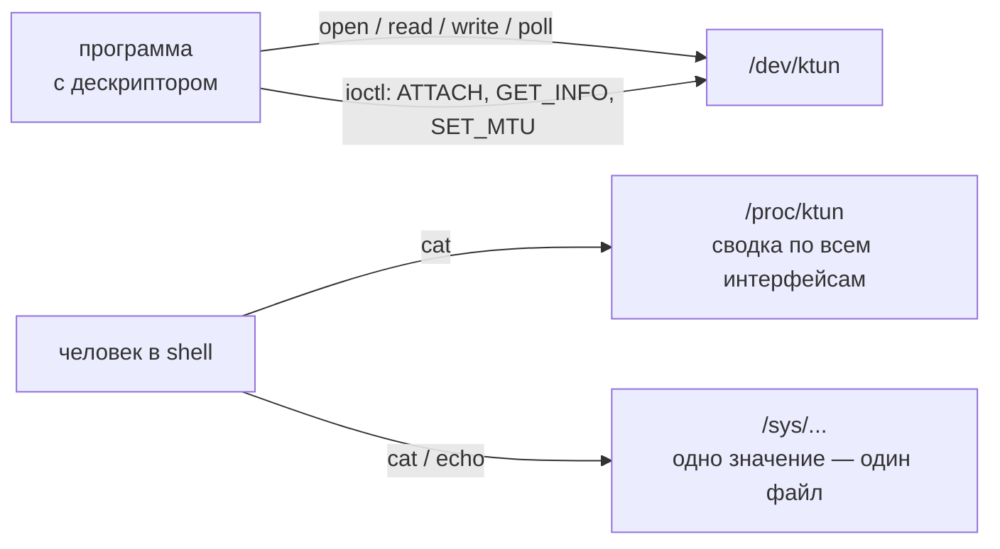
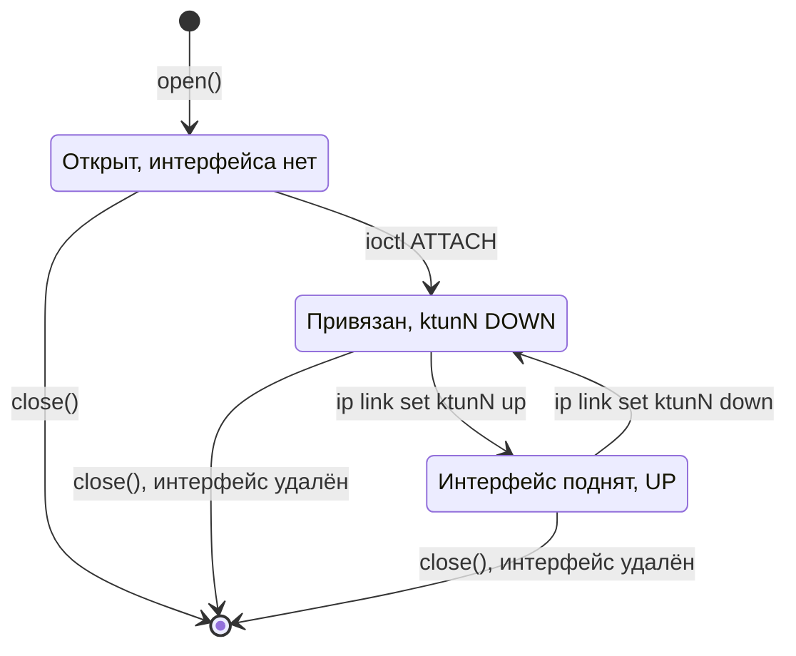
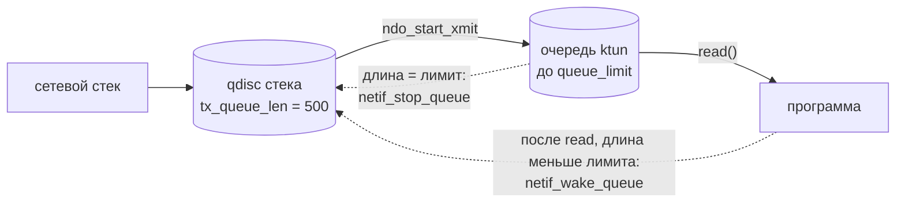

# KernelTunDriver

> Модуль ядра Linux `ktun` — виртуальный сетевой интерфейс TUN-типа, упрощённый аналог
> `drivers/net/tun.c`. Итоговый проект курса OTUS «Разработка ядра Linux».

Модуль создаёт в системе **сетевой интерфейс без сетевой карты**. Он выглядит как `eth0`: у него есть
имя, адрес, MTU и счётчики в `ip link`. Но пакеты, которые система отправляет в этот интерфейс, не
уходят в провод. Их получает **обычная программа**, читая файл `/dev/ktun`. И наоборот: всё, что
программа записала в `/dev/ktun`, система воспринимает как пакет, пришедший из сети.

Так устроены VPN-клиенты, эмуляторы сетей и туннели: программа сама решает, что сделать с пакетом —
зашифровать, отправить по UDP или ответить на него.

| | |
|---|---|
| **Версия** | `0.1` (`MODULE_VERSION`) |
| **Ядро** | Linux 6.18.37 (LTS), запуск в QEMU |
| **Модуль** | `ktun.ko` → `/dev/ktun`, интерфейсы `ktun0`, `ktun1`, … |
| **Утилита** | `ktunctl` — печать пакетов и ответ на `ping` из userspace |
| **Проверка** | 12 приёмочных сценариев на отладочном ядре (KASAN, lockdep, kmemleak, `DEBUG_ATOMIC_SLEEP`) — все пройдены |
| **Лицензия** | GPL-2.0; заголовок ABI `ktun_ioctl.h` — GPL-2.0 WITH Linux-syscall-note |

## Быстрый старт
```sh
make qemu-setup-debug   # один раз: отладочное ядро + initramfs (долго)
make qemu-build tools   # build/ktun.ko и build/ktunctl
devtools/boot.sh --test /mnt/host/devtools/demo.sh   # ping через ktun0, в конце "demo: OK"
```

Подробности — в разделах [Сборка и запуск](#сборка-и-запуск) и [Демонстрация](#демонстрация).

## Как это работает
### Общая картина


```mermaid
flowchart TB
    subgraph US["Пространство пользователя"]
        PING["ping 10.0.0.2"]
        CTL["ktunctl echo"]
    end
    subgraph K["Ядро"]
        STACK["Сетевой стек<br/>маршрутизация, ICMP"]
        subgraph MOD["Модуль ktun.ko"]
            NET["ktun0<br/>struct net_device"]
            Q[("очередь пакетов<br/>sk_buff_head")]
            CHR["/dev/ktun<br/>file_operations"]
        end
    end

    PING -- "sendto()" --> STACK
    STACK -- "ndo_start_xmit()" --> NET
    NET -- "в хвост" --> Q
    Q -- "из головы" --> CHR
    CHR -- "read()" --> CTL
    CTL -- "write() ответа" --> CHR
    CHR -- "netif_rx()" --> STACK
    STACK -- "echo reply" --> PING
```

Модуль соединяет две сущности ядра:

- **сетевой интерфейс** (`struct net_device`) — с ним разговаривает сетевой стек;
- **символьное устройство** `/dev/ktun` (`struct file_operations`) — с ним разговаривает программа.

Между ними — очередь пакетов. Она нужна потому, что стек отправляет пакет в атомарном контексте, где
нельзя ни спать, ни копировать данные в память программы, а программа в этот момент может вообще не
сидеть в `read()`. Очередь разводит эти два события во времени.

### Путь пакета

```mermaid
sequenceDiagram
    autonumber
    participant P as ping
    participant S as сетевой стек
    participant D as ktun (модуль)
    participant U as ktunctl

    Note over S,D: TX интерфейса: стек → программа
    P->>S: echo request на 10.0.0.2
    S->>D: ndo_start_xmit(skb)
    D->>D: skb в очередь, tx_packets++, разбудить читателей
    U->>D: read(fd)
    D-->>U: IP-пакет целиком (один read = один пакет)

    Note over S,D: RX интерфейса: программа → стек
    U->>U: собрать echo reply
    U->>D: write(fd, пакет)
    D->>D: новый skb, проверка версии IP, rx_packets++
    D->>S: netif_rx(skb)
    S-->>P: echo reply
```

### Почему TX и RX «перевёрнуты»
Счётчики считаются **с точки зрения интерфейса**, как у настоящей сетевой карты. Это первое, что
путает при отладке:

| Направление | Для интерфейса `ktun0` | Для программы | Функции драйвера |
|-------------|------------------------|---------------|------------------|
| стек → программа | **TX** — передано | **читает** из `/dev/ktun` | `ndo_start_xmit` → очередь → `read` |
| программа → стек | **RX** — принято | **пишет** в `/dev/ktun` | `write` → `netif_rx` |

### TUN, а не TAP
Через `/dev/ktun` ходят **голые IP-пакеты**, без Ethernet-заголовка: первый байт прочитанного пакета —
начало IP-заголовка. У интерфейса нет MAC-адреса, и ARP не нужен:

| Поле `net_device` | Значение |
|-------------------|----------|
| `type` | `ARPHRD_NONE` |
| `flags` | `IFF_POINTOPOINT \| IFF_NOARP` |
| `hard_header_len`, `addr_len` | `0` |
| `mtu` / `min_mtu` / `max_mtu` | `1500` / `68` / `9000` |
| `tx_queue_len` | `500` — очередь стека (qdisc) для управления потоком |

## Интерфейсы модуля
Модуль разговаривает с внешним миром по четырём каналам, у каждого своя ниша.


```mermaid
flowchart LR
    APP["программа<br/>с дескриптором"] -- "open / read / write / poll" --> DEV["/dev/ktun"]
    APP -- "ioctl: ATTACH, GET_INFO, SET_MTU" --> DEV
    SH["человек в shell"] -- "cat" --> PROC["/proc/ktun<br/>сводка по всем интерфейсам"]
    SH -- "cat / echo" --> SYS["/sys/...<br/>одно значение — один файл"]
```

### `/dev/ktun` — данные
| Вызов | Поведение |
|-------|-----------|
| `open` | создаёт **пустое** состояние файла; интерфейса ещё нет |
| `ioctl(KTUN_IOC_ATTACH)` | создаёт `ktunN` и навсегда привязывает его к этому открытому файлу |
| `read` | один вызов = один пакет; ждёт, если очередь пуста (`EAGAIN` при `O_NONBLOCK`) |
| `write` | один вызов = один IPv4/IPv6-пакет; интерфейс должен быть поднят |
| `poll` | `EPOLLIN`, когда в очереди есть пакет; запись готова всегда; `EPOLLERR`, пока файл не привязан |
| последний `close` | удаляет интерфейс и всё, что было в очереди |

Если буфер `read` меньше пакета, программа получает начало пакета, остаток отбрасывается, а счётчик
`truncated` в `/proc/ktun` растёт. Буфера на 64 КиБ хватает для любого MTU.

| Ошибка | `read` | `write` |
|--------|--------|---------|
| `EBADFD` | файл не привязан к интерфейсу | файл не привязан к интерфейсу |
| `EAGAIN` | очередь пуста, `O_NONBLOCK` | — |
| `EIO` | — | интерфейс опущен (`DOWN`) |
| `EINVAL` | — | длина меньше 20 байт или больше MTU; версия IP не 4 и не 6 |
| `EFAULT` | плохой указатель буфера | плохой указатель буфера |

**Жизненный цикл открытого файла:**

```mermaid
stateDiagram-v2
    state "Открыт, интерфейса нет" as Opened
    state "Привязан, ktunN DOWN" as Attached
    state "Интерфейс поднят, UP" as Up
    [*] --> Opened: open()
    Opened --> Attached: ioctl ATTACH
    Attached --> Up: ip link set ktunN up
    Up --> Attached: ip link set ktunN down
    Opened --> [*]: close()
    Attached --> [*]: close(), интерфейс удалён
    Up --> [*]: close(), интерфейс удалён
```

**Каждая программа — своя очередь.** Состояние хранится в открытом файле (`file->private_data`),
поэтому два процесса, открывших `/dev/ktun`, получают два независимых интерфейса и две очереди. Так
выполняется требование курса «у каждого процесса свой буфер». Процессы после `fork()` делят один
открытый файл, а значит, и одну очередь — как и в настоящем `tun`.

### `ioctl` — управление
ABI в [src/ktun_ioctl.h](src/ktun_ioctl.h) общий для модуля и утилиты, поля фиксированной ширины.

| Команда | Что делает | Основные ошибки |
|---------|------------|-----------------|
| `KTUN_IOC_ATTACH` | создать интерфейс; пустое имя → `ktun%d` | `EPERM` без `CAP_NET_ADMIN`, `EBUSY` уже привязан, `EEXIST` имя занято, `EINVAL` плохое имя |
| `KTUN_IOC_GET_INFO` | имя, `ifindex`, MTU, длина и лимит очереди | `EBADFD` не привязан |
| `KTUN_IOC_SET_MTU` | сменить MTU (`dev_set_mtu` под `rtnl_lock`) | `EBADFD`, `EINVAL` вне `[68, 9000]` |
| любая другая | — | `ENOTTY` |

### `/proc/ktun` — сводка
```console
# cat /proc/ktun
name     pid    state  queue   rx_packets  rx_bytes  tx_packets  tx_bytes  tx_dropped  truncated
ktun0    102    up     0/64    0           0         1           48        0           0
ktun1    104    up     0/64    2           168       3           216       0           0
```

`queue` — сколько пакетов ждут чтения и лимит очереди. `tx_dropped` — пакеты, которые драйвер
отбросил, потому что очередь уже была полна. При исправном управлении потоком этот счётчик равен нулю:
стек останавливается раньше (см. [Управление потоком](#управление-потоком)).

### `/sys` — настройки
| Файл | Доступ | Смысл |
|------|--------|-------|
| `/sys/class/misc/ktun/default_queue_limit` | rw | лимит очереди для новых интерфейсов, `[1, 4096]`, по умолчанию `64` |
| `/sys/class/misc/ktun/interface_count` | ro | сколько интерфейсов существует |
| `/sys/class/net/ktunN/ktun/queue_limit` | rw | лимит очереди этого интерфейса |
| `/sys/class/net/ktunN/ktun/queue_len` | ro | сколько пакетов ждут чтения |
| `/sys/class/net/ktunN/ktun/owner_pid` | ro | PID процесса, создавшего интерфейс |

Значение вне `[1, 4096]` или не число отклоняется с `EINVAL`. Если поднять `queue_limit` у
остановленного интерфейса, драйвер сразу возобновляет передачу.

## Устройство изнутри
### Управление потоком
Если программа перестала читать, а стек продолжает отправлять, очередь росла бы без предела. Поэтому
у неё есть лимит, и на лимите драйвер просит стек подождать:


```mermaid
flowchart LR
    S["сетевой стек"] --> QD[("qdisc стека<br/>tx_queue_len = 500")]
    QD -- "ndo_start_xmit" --> Q[("очередь ktun<br/>до queue_limit")]
    Q -- "read()" --> U["программа"]
    Q -. "длина = лимит:<br/>netif_stop_queue" .-> QD
    U -. "после read, длина меньше лимита:<br/>netif_wake_queue" .-> QD
```

После `netif_stop_queue` драйвер **сразу перепроверяет** длину очереди. Иначе возможна гонка:
`read()` опустошил очередь и проверил «остановлена ли?» за мгновение до остановки, и очередь
осталась бы остановленной навсегда.

### Контексты и блокировки
`ndo_start_xmit` выполняется в атомарном контексте (softirq): там нельзя спать, брать мьютекс,
выделять память с `GFP_KERNEL` и вызывать `copy_to_user`. Отсюда выбор защиты для каждого объекта:

| Данные | Кто обращается | Защита |
|--------|----------------|--------|
| очередь пакетов | `ndo_start_xmit` (BH), `read` | встроенный спинлок `sk_buff_head` |
| счётчики `dev->stats` | `ndo_start_xmit`, `write` | атомарные `DEV_STATS_INC` / `DEV_STATS_ADD` |
| лимит очереди | `ndo_start_xmit`, `/sys` | `READ_ONCE` / `WRITE_ONCE` |
| привязка файла к интерфейсу | `ioctl` из нескольких потоков | мьютекс в состоянии файла |
| глобальный список интерфейсов | `ATTACH`, `close`, `/proc` | глобальный мьютекс |

### Владение `sk_buff`
У каждого пакета в каждый момент ровно один владелец, и освобождает его только владелец:

- стек вызвал `ndo_start_xmit(skb)` → пакет **наш**: положить в очередь или освободить;
- `read()` забрал пакет из очереди → скопировал программе → освободил;
- `write()` создал пакет и вызвал `netif_rx(skb)` → пакет **стека**, трогать его больше нельзя.

Нарушение в одну сторону ловит kmemleak (утечка), в другую — KASAN (use-after-free).

### Порядок удаления интерфейса
При последнем `close()` каждый шаг опирается на гарантию предыдущего:


```mermaid
flowchart LR
    A["1. убрать из<br/>глобального списка"] --> B["2. unregister_netdev<br/>xmit больше не придёт"]
    B --> C["3. skb_queue_purge<br/>очистить очередь"]
    C --> D["4. free_netdev<br/>вместе с личными данными"]
    D --> E["5. освободить<br/>состояние файла"]
```

Выгрузить модуль, пока открыт хоть один `/dev/ktun`, нельзя: `.owner = THIS_MODULE` держит ссылку на
модуль, и `rmmod` вернёт ошибку (`Resource temporarily unavailable`).

### Структура исходников
```text
.
├── Makefile              # сборка модуля (qemu-*) и утилиты (tools)
├── src/
│   ├── Kbuild            # ktun.o = main.o chardev.o netdev.o procfs.o sysfs.o
│   ├── ktun.h            # внутренние структуры: ktunNet (интерфейс), ktunFile (открытый файл)
│   ├── ktun_ioctl.h      # ABI ioctl, общий с утилитой
│   ├── main.c            # init/exit, misc-устройство, глобальный список интерфейсов
│   ├── chardev.c         # file_operations /dev/ktun
│   ├── netdev.c          # net_device_ops, очередь пакетов, управление потоком
│   ├── procfs.c          # /proc/ktun
│   └── sysfs.c           # атрибуты /sys
├── tools/ktunctl.c       # утилита: dump / echo / selftest
└── devtools/
    ├── setup.sh          # скачать и собрать ядро + BusyBox initramfs (qemu-setup*)
    ├── build.sh          # собрать модуль против ядра QEMU
    ├── boot.sh           # запустить гостя: интерактивно, --gdb или --test CMD
    ├── test.sh           # insmod -> dmesg -> rmmod (qemu-test)
    ├── gdb.sh            # подключить GDB к гостю
    ├── demo.sh           # демонстрация ping через ktun0 (запускается в госте)
    ├── config.defaults   # версии, пути, память и CPU гостя
    ├── kernel*.config    # фрагменты конфигурации ядра (обычный и отладочный)
    └── initramfs/init    # PID 1 гостя: монтирование, 9p, режим --test
```

## Сборка и запуск
Модуль собирается и грузится **не в ядро хоста, а в отдельное ядро в QEMU**. Так проект одинаково
работает на обычном Linux и под WSL2, где заголовков ядра хоста нет.

**Зависимости хоста:** `gcc`, `make`, `qemu-system-x86_64`, инструменты сборки ядра (`flex`, `bison`,
`bc`, `libelf-dev`, `libssl-dev`), статическая `libc` для утилиты (`libc6-dev` в Debian). Необязательно:
`gdb`, `clang-format`, `bear`. Если `/dev/kvm` доступен на запись, QEMU использует KVM, иначе
работает медленнее, в программной эмуляции.

```sh
make qemu-setup-debug   # один раз: ядро 6.18 с KASAN/lockdep/kmemleak + BusyBox initramfs
make qemu-build         # модуль  -> build/ktun.ko
make tools              # утилита -> build/ktunctl (статическая: в госте нет libc)
make qemu-test          # автотест: insmod -> dmesg -> rmmod, печатает TEST_OK
make qemu-boot          # интерактивный гость; каталог проекта смонтирован в /mnt/host
```

| Цель `make` | Назначение |
|-------------|------------|
| `qemu-setup` | ядро без отладочных опций: собирается и работает быстрее |
| `qemu-debug` + `gdb-attach` | гость ждёт GDB на порту `1234`; второе в соседнем терминале |
| `load` / `unload` | `insmod`/`rmmod` в ядро **хоста** (нужны его заголовки; не для WSL2) |
| `format` | `clang-format` для `src/` и `tools/` |
| `compdb` | `.vscode/compile_commands.json` для clangd/IntelliSense |
| `clean` | удалить `build/` |
| `help` | список целей QEMU |

Настройки стенда — в [devtools/config.defaults](devtools/config.defaults); переопределения кладутся в
`devtools/config.local` (не в git). KASAN примерно удваивает расход памяти гостя, поэтому для
отладочного ядра стоит задать `QEMU_MEM="2G"`. Если `cdn.kernel.org` недоступен, помогает
`KERNEL_PREFER_MIRROR=1` — исходники скачиваются с зеркала на GitHub.

## Демонстрация
### Ответ на `ping` из userspace
Весь сценарий записан в [devtools/demo.sh](devtools/demo.sh). Его можно запустить без интерактивного
входа: `devtools/boot.sh --test /mnt/host/devtools/demo.sh`. Или вручную в госте (`make qemu-boot`):

```console
# insmod /mnt/host/build/ktun.ko
# /mnt/host/build/ktunctl echo &
ktun0
# ip link set ktun0 up
# ip addr add 10.0.0.1/24 dev ktun0
# ping -c 3 10.0.0.2
PING 10.0.0.2 (10.0.0.2): 56 data bytes
64 bytes from 10.0.0.2: seq=0 ttl=64 time=29.880 ms
64 bytes from 10.0.0.2: seq=1 ttl=64 time=4.807 ms
64 bytes from 10.0.0.2: seq=2 ttl=64 time=4.308 ms

--- 10.0.0.2 ping statistics ---
3 packets transmitted, 3 packets received, 0% packet loss
```

Параллельно `ktunctl` печатает каждый пакет и строку `ktun0:   -> echo reply written` на каждый
отправленный ответ.

Машины с адресом `10.0.0.2` не существует. На `ping` отвечает `ktunctl`: она прочитала echo request,
поменяла местами адреса, сменила тип ICMP на echo reply, пересчитала контрольные суммы и записала
пакет обратно.

### Режимы `ktunctl`
```text
ktunctl [-n NAME] [-m MTU] dump      # печатать каждый пакет
ktunctl [-n NAME] [-m MTU] echo      # печатать и отвечать на IPv4 ICMP echo request
ktunctl selftest                     # проверить коды ошибок, которые не получить из shell
```

`-n` задаёт имя интерфейса (можно шаблон вида `vpn%d`), `-m` — MTU сразу после создания. `dump` и
`echo` первой строкой печатают имя созданного интерфейса и работают до сигнала; при их завершении
интерфейс исчезает.

```console
# ktunctl dump
ktun0
ktun0: IPv6 len=48 (skipped)
ktun0: IPv4 ICMP 10.0.0.1 -> 10.0.0.2 echo request id=86 seq=0 len=84
```

Утилита не настраивает адрес и не поднимает интерфейс — это делают стандартные команды `ip`. Так
видна граница между драйвером и обычной настройкой сети. IPv6-пакеты сразу после `up` — служебные
сообщения самого стека, утилита их только печатает.

## Проверка
Все сценарии выполняются подряд в одном сеансе QEMU на отладочном ядре 6.18.37 (2 CPU, 2 ГБ).
Последний прогон — 28.09.2026, версия `0.1`: **все 12 сценариев пройдены**.

| # | Сценарий | Результат |
|---|----------|-----------|
| T1 | загрузка и выгрузка | `/dev/ktun` — `crw-------`, `/proc/ktun` и `default_queue_limit = 64` на месте, `rmmod` успешен |
| T2 | чтение непривязанного файла | `cat /dev/ktun` → `EBADFD` (`File descriptor in bad state`) |
| T3 | привязка | `ktun0: <POINTOPOINT,NOARP> mtu 1500 qlen 500`, `owner_pid` совпадает с PID `ktunctl` |
| T4 | стек → программа | `dump` видит `echo request`, в `/proc/ktun` растёт TX |
| T5 | ответ на `ping` | `3 packets transmitted, 3 packets received, 0% packet loss` |
| T6 | закрытие файла | после завершения `ktunctl` — `can't find device 'ktun0'`, `/proc/ktun` пуст |
| T7 | две программы | `ktun0` и `ktun1` с независимыми очередями и счётчиками, `interface_count = 2` |
| T8 | управление потоком | читатель остановлен, `queue_limit = 4`, 10 пингов: очередь `4/4`, `tx_dropped = 0`, нет `asks to queue packet`; после `SIGCONT` очередь пуста и трафик идёт |
| T9 | настройки `/sys` | `0` и `abc` → `EINVAL`; после `128` новый интерфейс получает `queue_limit = 128` |
| T10 | MTU | `-m 1400` → `mtu 1400` в `ip link`; `-m 10` → `attach: Invalid argument` |
| T11 | `ktunctl selftest` | все проверки `PASS`, код выхода `0` |
| T12 | выгрузка и утечки | при открытом файле `rmmod` отказывает; после закрытия выгружается; kmemleak и `dmesg` пусты |

В госте BusyBox, и его `ip` не поддерживает `-s`, поэтому счётчики в T4–T8 смотрятся через
`/proc/ktun`.

**Критерий чистоты:** в `dmesg` нет `BUG:`, `WARNING:`, `possible circular locking`,
`sleeping function called from invalid context`; kmemleak ничего не находит.

`ktunctl selftest` проверяет ошибки, которые не получить из shell:

```console
# ktunctl selftest
PASS 1 read unattached -> File descriptor in bad state
PASS 2 write unattached -> File descriptor in bad state
PASS 3 unknown ioctl -> Inappropriate ioctl for device
PASS 4 attach -> ktun0
PASS 4 second attach -> Device or resource busy
PASS 5 write while down -> Input/output error
PASS 6 SET_MTU 10 -> Invalid argument
PASS 6 SET_MTU 100000 -> Invalid argument
PASS 7 SET_MTU 1400 -> GET_INFO mtu=1400
PASS 8 nonblocking read, empty queue -> Resource temporarily unavailable
PASS 9 attach "lo" -> File exists
selftest: PASS
```

**Стиль кода.** Имена в проекте — в личном стиле автора (PascalCase для функций, camelCase для
переменных, `_` перед полями структур), поэтому `checkpatch` запускается без проверки CamelCase:

```sh
devtools/.cache/linux-*/scripts/checkpatch.pl --no-tree --ignore CAMELCASE -f src/*.c src/*.h tools/*.c
```

## Ограничения
Это сознательные решения, а не недоделки:

| Не поддерживается | Почему |
|-------------------|--------|
| режим TAP (L2, Ethernet-кадры) | вдвое больше работы с заголовками и ARP; TUN полностью раскрывает тему |
| `ip link add type ktun` | требует `rtnl_link_ops` и netlink — отдельная подсистема |
| интерфейсы, переживающие закрытие файла | усложняет жизненный цикл |
| несколько очередей, привязка к CPU, NAPI | вопросы производительности, а не корректности |
| offload'ы (GSO, аппаратные контрольные суммы) | железа нет |
| сетевые пространства имён | интерфейсы создаются в основном пространстве |
| ответ на IPv6 в `ktunctl` | IPv6-пакеты только печатаются |
